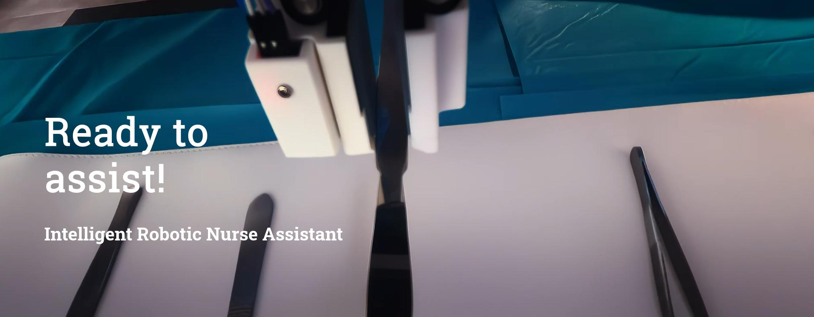
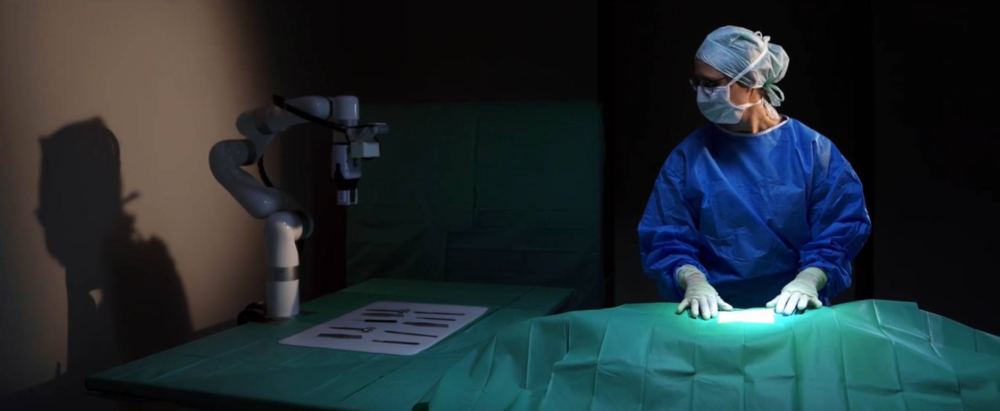
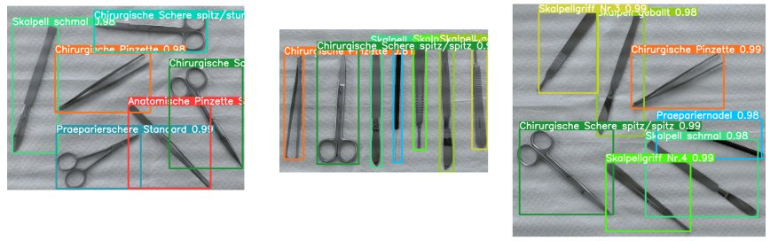
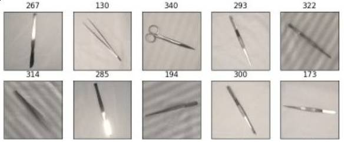

# Rona - the Robotic Nurse Assistant

[](https://more.doccheck.com/en/rona/)


# Meet Rona - your Open Source assistant for surgical procedures

Rona is an upgrade kit for robotic arms designed to address the problem with declining numbers of nurses in hospitals in
Germany, but also around the world. Rona's development is dedicated to create an affordable, easy to use, one-of-a-kind
software upgrade for surgery procedures and interventions where an additional hand is required, but a human support
might not be available.

The idea is to build an add-on that can be modular enough to be applicable to different robotic arms.
The system can be used with customizable machine learning models for instrument detection, angle estimation and wake-word detection.

For more information visit also: https://more.doccheck.com/en/rona/ 

[](https://more.doccheck.com/en/rona/)

# Project Overview

## Requirements

### Hardware

Required hardware:

- a robotic arm. Currently only the [UFactory xArm5](https://www.ufactory.cc/xarm-collaborative-robot/) is supported
- a two-finger gripper e.g. [UFactory xArm Gripper](https://www.ufactory.cc/product-page/ufactory-xarm-gripper/) for the
  xArm5
- a camera holder for the robot e.g. [UFactory camera stand](https://www.ufactory.cc/product-page/ufactory-xarm-camera-stand/)
- a depth camera. Currently only the [Intel Realsense D435](https://www.ufactory.cc/xarm-collaborative-robot/) is  supported and tested in this setup
- a suitable microphone 
- a RaspberryPi Pico
- a [SW420 vibration sensor](https://www.az-delivery.de/en/products/sw420-vibration-schuttel-erschutterung-sensor-modul)
- 3D printable gripper tips, mounts and casings. CAD files can be found in the [3D models](docs/parts) folder
- cables and screws (more details in the assembly tutorial below)

For assembly and setup of the hardware parts check the [assembly tutorial](docs/assembly_tutorial.md) first.

### Software

Required software:

- [Linux machine with Ubuntu 22.04](https://ubuntu.com/download/desktop)
- [ROS2 Humble](https://docs.ros.org/en/humble/Installation.html)
- [Python 3.10+](https://www.python.org/downloads/)
- [Intel® RealSense™ SDK 2.0](https://github.com/IntelRealSense/librealsense/blob/master/doc/distribution_linux.md)
- [UFactory xArm-Python-SDK Version 1.13.0](https://github.com/xArm-Developer/xArm-Python-SDK) 
- various libraries python libraries explained in the [quickstart guide](docs/quickstart.md)

To install the software and the necessary libraries follow the [quickstart guide](docs/quickstart.md) \
For more detailed information on each ROS2 module check the [module documentation](docs/modules.md).


## Installation
- Get the necessary hardware listed in the [assembly guide](docs/assembly_tutorial.md) and follow it for the full assembly of the system.
- Follow the [quickstart guide](docs/quickstart.md) and install the necessary software, train or download all the necessary models for instrument detection, angle estimation and wake-word detection. 
- Do the [one-time configurations](docs/config.md) before you can continue with the usage of Rona


# How to use Rona
## Starting the system
Make sure you followed the [assembly guide](docs/assembly_tutorial.md), the [quickstart guide](docs/quickstart.md) and the [configuration](docs/config.md) before proceeding.
If everything is done successfully, you can start with the following commands in the rona_ws/ folder:

```bash
# Build and source the packages again just in case
$ make build-workspace

# Start system
$ make start-system
```

When Rona successfully boots up she will inform the user vocally that she is ready. 

## Wake word
In idle mode Rona will listen for her wake-word "Hey, Rona...". If she hears it she will open her gripper to signal that she starts listening for commands. 

          User: "Hey, Rona..."
          Rona: *opens gripper and starts listening to commands* 

The default listening time is 5 seconds. 
After this time she will close her gripper and go back to idle mode.

## Voice Commands
The system has 3 main commands for handling instruments: 
- *give/take* - Give an instrument from the tray to the surgeon
- *return* - Return an instrument from the surgeon to the tray
- *change* - First return an instrument, then take an instrument from the tray.

In addition to this there are 5 commands for system control:
- *cancel* - Cancel the current command
- *recalibration* - Recalibrates the transfer position
- *reset* - Reset the system
- *save* - saves the calibration
- *shut down* - shuts down the system and Rona will move into the shutdown position

## Dialogue Flow

Rona will indicate that she heard the wake word by opening her gripper. While the gripper is open, she is listening for commands. When the gripper is closed
you need to say the wake-word again and wake her up. The default listening time is 5 seconds.  

* ***give/take***: Rona will scan the table for an instrument and will pick it up and bring it to the transfer position.
    She will confirm your choice vocally if she heard you correctly.

          U: "Give me the blunt scissors" / "Take the narrow scalpel"
          R: "Blunt scissors chosen" / "Narrow scalpel chosen"

    If the command is incomplete, for example you don't know which scissors you want or are available, she will help you
    out by listing out all the possible instruments of that variety automatically. And you can immediately repeat your
    answer to her to lock in the choice.

          U: "Give me scissors"
          R: "Wrong input! You can choose between blunt and pointed scissors."
          U: "Blunt scissors"

    If she for any reason could not find the instrument after a couple of seconds, she will tell you and go back to sleep.

          U: "Give me the blunt scissors"
          R: "Could not find instrument"

    If you don't take the instrument after some time she will cancel the give command, return it back to its place and
    will move back to home position to scan and wait for your wake-word and command.


* ***return***: Rona will scan the instrument table for free slots and checks if any are missing (because you have taken
  them). If you call for return when you don't have an instrument, she will tell you that it is not possible and that
  all instruments are on the table. Otherwise, she will go to the transfer position and await for you to return your
  instrument.

        U: "Return"
        R: "Return has been chosen" / "Return is not possible, instruments are on the table"

  If you don't place the instrument in the gripper after some time she will cancel the return and move back to home
  position to scan and wait for your wake-word and command.

  The returning position is picked with the help of the empty slot detector. As mentioned in the previous chapter the
  detector should be setup depending on how many instruments you have, but generally there will always be at least one
  free slot if you have already taken an instrument and want to return or change. Typically, the empty slot is chosen at
  random if there is more than one available.


* ***change***: Rona will change one of your instruments with a new one of your choosing. This means she expects you to
  first return one instrument, and then she will give you the one you asked for immediately after that. This is basically
  like *return + give* in one sequence, so all the rules and conditions from their separate calls are the same for this
  command as well.

        U: "Change with narrow scalpel"
        R: "Changing with narrow scalpel" / "Could not find instrument"

  If you fail to return the instrument during the return window, you will not get your new instrument and will have to
  invoke a command anew.

These 3 commands are Rona's bread and butter and now is a good time to talk about the key point in all of them - that is
the transfer. To have a successful transfer in any of the commands, we need to check-off 3 security steps. These checks
start the moment Rona arrives at the transfer position.

1. ***hand detection***: Rona starts the camera and runs the hand detection. If she sees an arm she starts the second
   check which is the depth measurement. If the hand exits the frame before completing the first two checks, the
   scanning resets and starts again from the hand detection.

2. ***distance measurement***: Rona checks if the seen hand is close enough to the gripper for a transfer to occur. We
   wouldn't want to see a hand somewhere in frame and then Rona just assuming it is time to release the instrument and
   drop it on the patient. If the hand is in the right position near the gripper the third check starts.

3. ***shock sensor***: Rona starts checking for an impulse on her gripper tip - meaning you either put an instrument
   there, and she should close the gripper and take it - or you've grabbed the instrument with your hand, and she should
   release it. In both cases she delays for about a second before starting to move again, so that you can remove your
   hand from her.

If no impulse is detected in a given time, she starts the check again from the beginning, if the system's maximal
transfer time hasn't expired yet. There is a bit of getting used to passing the transfer safety checks, but there is
relatively big freedom of movement for the user. The main things are to approach the instrument from the side where the
camera is and tap the gripper tip that has the sensor in it. In the demo section we have provided some visual examples,
so check them out.

Next we want to briefly explain the system control commands.

* ***reset***: If Rona gets stuck because of a kinematic error she won't be able to move until getting her motors
  unblocked first. With the reset command we can unblock Rona and reset her to her home position.

        U: "Reset"
        R: "The system is resetting"

* ***shut down***: At the end of the use we can shut down Rona with this command. All her services will exit cleanly,
  she will move down to her shutdown position and will turn off. We still need to turn of the robot arm manually though.

        U: "Shut down"
        R: "The system im shutting down"

* ***recalibration***: If we want to change the transfer position while the system is online , for example during a
  surgery it needs to be moved. With this command the robot arm goes into manual moving mode, and we can grab the arm and
  adjust it in any position we desire. This is very helpful, because we can visually see where the new transfer point is
  going to be, and we have all the freedom to adjust it properly.

        U: "Recalibrate"
        R: "Recalibration started"

From here we have two choices, we can either ***save*** or ***cancel*** the recalibration with the respective commands.
If we try to give any other instructions instead, Rona will prompt us to save changes before we can continue. This means
we either have to save or cancel before we can get back to normal operations.

With this we are armed with all the knowledge needed to use Rona! Check out the next section for more visual examples
and the Roadmap section to see what we still plan to do in the future. Of course, feel free to leave any suggestions or
make any improvements of your own!


#  Customizable Machine Learning Models 
Rona uses several machine learning models for different tasks. To enable a wider range of potential use cases each model can be trained and customized to the user's specific needs following the guides in separate repositories. \
For experimentation we provide pretrained models on huggingface.

### Surgical Instrument Detection

- YOLOv5 architecture custom trained on 12 different surgical instruments
- More details and a guide for customized training can be found in our separate [Surgical Instrument Detection repository](https://github.com/DocCheck/Surgical-Instrument-Detector/)
- Our trained model can be downloaded from [huggingface](https://huggingface.co/DocCheck/medical-instrument-detection).

### Instrument Angle Estimator

- Modified RotNet architecture custom trained to estimate the angles on 12 different surgical instruments
- More details and a guide for customized training can be found in our separate [Instrument Angle Estimator repository](https://github.com/DocCheck/Instrument-Orientation-Estimator/)
- Our trained models can be downloaded from [huggingface](https://huggingface.co/DocCheck/medical-instrument-orientation-estimation). 

### Wake-word detection 
- OpenWakeWord model trained on the activation phrase "Hey, Rona"
- More details and a guide for customized training can be found in the great [OpenWakeWord repository](https://github.com/dscripka/openWakeWord)
- Our trained model can be downloaded from [huggingface](https://huggingface.co/DocCheck/wakeword-hey-rona).


# How To Get Involved
Do you want to support the development? We are always looking for new contributors and feedback.
### Bugs and issues
If you found an issue or have a feature request, please open an issue on the [issue tracker](https://github.com/DocCheck/Rona/issues)

### Code contribution
If you want to contribute to the code by implementing new features or port the system to a different robotic arm, feel free to contribute to this project and the related repositories.

### Partnering up
If you want to partner up with us and continue the developing the project with us, please contact us at: https://more.doccheck.com/en/rona/
