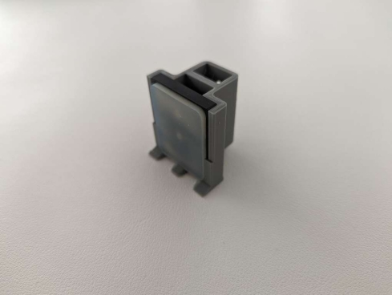

This is an assembly tutorial for Rona's hardware.

**List of parts**:

- [UFactory xArm 5 robot arm](https://www.ufactory.cc/xarm-collaborative-robot/)
- [UFactory Gripper](https://www.ufactory.cc/product-page/ufactory-xarm-gripper/)
- [UFactory camera stand](https://www.ufactory.cc/product-page/ufactory-xarm-camera-stand/)
- [Intel RealSense D435 camera](https://www.intelrealsense.com/depth-camera-d435/)
- [Raspberry Pi Pico](https://www.az-delivery.de/en/products/raspberry-pi-pico)
- [sw420 vibration sensor module](https://www.az-delivery.de/en/products/sw420-vibration-schuttel-erschutterung-sensor-modul)
---
- Ethernet cable, 3m+ for the robot connection
- USB C 3.0+, 3m+ for the camera (preferably with a 90 degrees angle to the right)
- Micro USB, 3m+ for the controller (preferably with a 90 degrees angle to the right)
- 3 female-to-female jumper wire cables for the sensor
---
- 4x M3x10 self tapping screws for the controller bed / camera extension
- 1x M3x16 screw for the sensor and gripper tip cap
- 2x M3x10 screws for the simple gripper tip cap
- 4x M1.5x4/M1.5x5 self tapping screws for the controller
---
- Controller bed (3d printed)
- Controller cover (3d printed)
- Camera extension (3d printed)
- Gripper tip cap (simple) (3d printed)
- Gripper tip cap (sensor) (3d printed)

    

**Assembly**:

First of all mount the robot on a flat surface with enough space around it. Install the UFactory camera stand and the UFactory gripper next. Connect the power-control cable of the gripper to the robot flange. Take the simple gripper tip cap and install it over the original tips. To do so - unscrew the original gripper tips from the gripper and place them inside the caps. After that screw it back on by sliding it onto the gripper and using the 2x M3x10 screws tightening accordingly.

Take the sensor gripper tip cap next and put the sensor inside. Connect the jumper cables to the sensor pins before mounting the cap makes it easier to reach. The way we mount it is we screw everything together - cap, sensor and gripper with the 1x M3x16 screw. The screw goes through the upper hole (*red arrow*) of the cap and through the hole of the sensor and screws both cap and sensor tightly to the gripper. Through the bottom hole you can adjust the sensitivity of the sensor via the potentiometer without having to disassemble the gripper tip cap.

Next thing is positioning the camera extension on top of the UFactory camera stand and from the under side position the controller bed. Through the 4 holes on the bed screw it to the camera extension through the UFactory camera stand with the 4x M3x10 self tapping screws. 

Next thing is to prepare the Raspberry Pi Pico. Typically the Pico comes unsoldered, which is good in our case. We need to solder the pins pointing upwards, so that it can be correctly mounted on the bed. After soldering, screw the Raspberry Pi to the controller bed via two to four of the M1.5x4 self tapping screws (or similar). Make sure to position the controller in the correct orientation, with the USB port pointing left, when you are looking at the robot from the front. After that plug in the jumper wire cables coming out of the sensor onto the correct pins of the controller, as shown in the diagram bellow. Finally, plug in the USB cable in the Pico to power it up.

Now, carefully slide on the controller cover onto the controller bed. Bend the jumper cables a bit with your fingers so that they get inside the cover and don't bend any controller pins from the pushing. If everything is printed and assembled correctly, the cover should easily snap into place.

Lastly, screw the Intel camera to the camera extension and connect the USB C cable. 

Finally, connect the cables of the UFactory controller to the robot arm and the Ethernet cable between the controller and your computer. Plug in the power cable for the robot controller. In the end the complete system should look something like this:

This concludes the system assembly. You should now move on to installing all the software via the README.md or if already done testing with the help of the test functions provided.